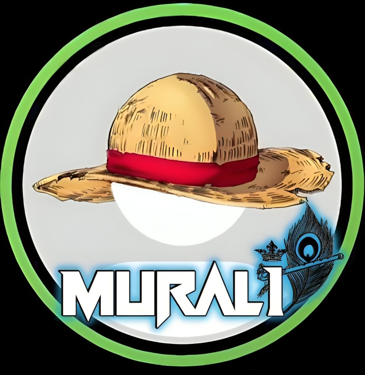

 
    
 
 

  

  

# 🌟 **Welcome to My Portfolio** 🌟

Hey there! I'm Murali, a passionate learner and an aspiring developer.  
While I’m not a pro coder (yet 😅), I’m deeply curious and always eager to explore the endless world of technology!

In this space, you’ll find my projects, ideas, and experiments as I grow my skills and dive deeper into development. From web applications to small coding challenges, it's all part of my journey.

---

🌱 **Learning Every Day**  
I believe in progress over perfection. As I learn new languages, tools, and frameworks, I continuously update this portfolio with my latest work. 

💡 **What I’m Exploring Right Now:**  
- Web development (HTML, CSS, JavaScript)  
- APIs & Integrations  
- Open-source contributions  

---

🚀 **Take a look around!**  
Feel free to explore my work and connect with me. I'd love to hear your thoughts or collaborate on exciting projects! 

🔗 [**Visit my Portfolio**](https://muralibotz.github.io)

---

👨‍💻 _Built with love and curiosity by Murali_
